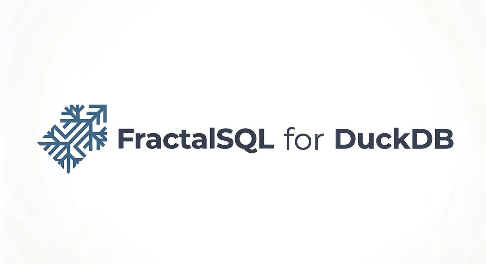

<p align="center">
  
</p>

# FractalSQL for DuckDB — Community Edition

**A vectorized discovery engine for DuckDB analytical workloads.**
`fractal_search()` runs Stochastic-Fractal-Search-refined cosine
distance against any `DOUBLE[]` column — on Parquet, Iceberg, S3, or
a local table, **without moving a single byte of data**.

The extension plugs into DuckDB's columnar execution engine. SFS
runs once per distinct query (cached in the function's per-pipeline
state); the per-row cosine loop runs at full vectorized throughput
across DuckDB's `DataChunk` batches.

## Why

- **Vector search where your data already lives.** Embeddings stored
  in Parquet / Iceberg / S3: `SELECT … fractal_search(…) FROM
  read_parquet('s3://…')`. No ETL into a separate vector DB.
- **Local-first analytics.** DuckDB is increasingly the runtime for
  notebooks, dbt models, and cloud data-lake query layers. Vector
  search on that runtime closes the loop.
- **Zero-dependency extension.** Static LuaJIT, static libstdc++ on
  Linux, static MSVC CRT on Windows, static libc++ on macOS. The
  `.duckdb_extension` file has no runtime deps beyond what DuckDB
  itself already pulls.

## SQL surface

```
fractalsql_edition() -> VARCHAR              -- 'Community'
fractalsql_version() -> VARCHAR              -- '1.0.0'
fractal_search(vector DOUBLE[],
               query_vector DOUBLE[]) -> DOUBLE
```

`fractal_search` returns the cosine distance between `vector` and an
SFS-refined projection of `query_vector` in `[-1, 1]^dim`. The
refinement is lifted out of the per-row path and cached in
`FunctionLocalState`, so a typical top-k query pays the SFS cost once.

## Compatibility matrix

| DuckDB version | Codename   | Status           | linux_amd64 | linux_arm64 | osx_amd64 | osx_arm64 | windows_amd64 |
|----------------|------------|------------------|:-----------:|:-----------:|:---------:|:---------:|:-------------:|
| 1.2.2          | Histrionicus | legacy ABI       |      ✓      |      ✓      |     ✓     |     ✓     |       ✓       |
| 1.4.4          | Andium     | LTS (Sept 2026)  |      ✓      |      ✓      |     ✓     |     ✓     |       ✓       |
| 1.5.2          | Variegata  | current stable   |      ✓      |      ✓      |     ✓     |     ✓     |       ✓       |

DuckDB's C++ extension ABI breaks across minor releases, so there is
one artifact per (DuckDB version, platform) cell. Each file is named
`fractalsql.duckdb_extension.<duckdb_version>.<platform>` — the tag
encodes identity. The loader refuses to load a mismatched build.

Pre-1.2 DuckDB (1.0 / 1.1) is **not shipped**: those versions are
absent from duckdb.org's download page, 1.1 LTS ended February 2025,
and both have an extension-loader quirk that crashes unsigned
third-party extensions at `LOAD` time. Users on those versions
should upgrade; 1.4.4 LTS is the recommended migration target.

`windows_arm64` is not shipped: DuckDB does not publish a matching
Windows ARM64 CLI upstream.

## Unsigned extension notice

The Community edition is **unsigned**. DuckDB's loader refuses
unsigned extensions unless you opt in. The supported opt-ins are:

- Start DuckDB with the `-unsigned` CLI flag (preferred, DuckDB 1.1+).
- Connect with the `allow_unsigned_extensions=true` config setting,
  set **before** the database is opened. DuckDB 1.1+ rejects changing
  this at runtime.

Every install example below uses the `-unsigned` flag. Once a
signing key is in place for future releases, this step goes away.

## Install

### 1. Download the artifact for your (DuckDB version, platform) cell

Grab the matching file from
[GitHub Releases](https://github.com/FractalSQLabs/duckdb-fractalsql/releases).
Each release publishes:

- `fractalsql.duckdb_extension.v<DUCKDB_VER>.<PLATFORM>` — raw extension
- `duckdb-fractalsql-v<DUCKDB_VER>-<PLATFORM>.zip` — bundle with
  `LICENSE`, `LICENSE-THIRD-PARTY`, `README.txt`

### 2. Load from the DuckDB shell

```bash
# 1. Start DuckDB with unsigned extensions allowed:
duckdb -unsigned
```

```sql
-- 2. LOAD by absolute path to the downloaded file:
LOAD '/path/to/fractalsql.v1.5.2.linux_amd64.duckdb_extension';

-- 3. Verify:
SELECT fractalsql_edition(), fractalsql_version();
-- returns: ('Community', '1.0.0')
```

### 3. Or programmatic (Python / Node / R)

```python
import duckdb

con = duckdb.connect(config={"allow_unsigned_extensions": True})
con.load_extension('/path/to/fractalsql.v1.5.2.linux_amd64.duckdb_extension')
con.sql("SELECT fractalsql_edition(), fractalsql_version()").show()
```

```javascript
const duckdb = require('duckdb');
const db = new duckdb.Database(':memory:', { allow_unsigned_extensions: 'true' });
db.run("LOAD '/path/to/fractalsql.v1.5.2.linux_amd64.duckdb_extension'");
```

```r
library(duckdb)
con <- dbConnect(duckdb(), config = list(allow_unsigned_extensions = "true"))
dbExecute(con, "LOAD '/path/to/fractalsql.v1.5.2.linux_amd64.duckdb_extension'")
```

## Example queries

```sql
LOAD '/path/to/fractalsql.v1.5.2.linux_amd64.duckdb_extension';

-- Local table.
CREATE TABLE embeddings AS
SELECT i AS id, [random(), random(), random()]::DOUBLE[] AS embedding
FROM range(0, 1000000);

SELECT id, fractal_search(embedding, [0.5, 0.5, 0.5]::DOUBLE[]) AS dist
FROM embeddings
ORDER BY dist
LIMIT 10;
```

```sql
-- Parquet on S3 — no data movement.
SELECT id,
       fractal_search(embedding, $query::DOUBLE[]) AS dist
FROM read_parquet('s3://my-bucket/embeddings/*.parquet')
ORDER BY dist
LIMIT 50;
```

```sql
-- Iceberg.
INSTALL iceberg; LOAD iceberg;

SELECT id,
       fractal_search(embedding, [0.1, 0.2, 0.3]::DOUBLE[]) AS dist
FROM iceberg_scan('s3://my-warehouse/embeddings_iceberg/')
ORDER BY dist
LIMIT 25;
```

## Building from source

```bash
./build.sh amd64    # -> dist/amd64/fractalsql.v1.5.2.linux_amd64.duckdb_extension
./build.sh arm64    # -> dist/arm64/fractalsql.v1.5.2.linux_arm64.duckdb_extension

# Pin a different DuckDB version:
DUCKDB_VERSION=v1.2.2 ./build.sh amd64
```

The Dockerfile (see `docker/Dockerfile`):

- Compiles LuaJIT 2.1 from source with `-fPIC BUILDMODE=static`, so
  the archive can fold into a shared object.
- Fetches DuckDB's full source tree at the pinned tag via CMake
  `FetchContent` (the `libduckdb-*.zip` release bundle omits the
  extension-facing API).
- Selects the C++ ABI per DuckDB version: **legacy gcc4**
  (`-D_GLIBCXX_USE_CXX11_ABI=0`, platform label
  `linux_<arch>_gcc4`) for v1.2.x, **new libstdc++** (platform
  label `linux_<arch>`) for v1.3+. The upstream CLI's ABI changed
  here, so extensions have to follow. Overridable via
  `-DLEGACY_CXX11_ABI=ON|OFF`.
- Links `-static-libgcc -static-libstdc++` and runs
  `docker/assert_so.sh` to gate the output on ldd / nm / size / .dynsym
  assertions.

Windows: `scripts\windows\build.bat` (run from a Developer Command
Prompt for VS 2022 x64). Static CRT via
`CMAKE_MSVC_RUNTIME_LIBRARY=MultiThreaded` under CMake policy
`CMP0091 NEW`, static LuaJIT (`lua51.lib` from `msvcbuild.bat
static`), plus `dumpbin /dependents` and `/exports` post-build
checks. `/GL` + `/LTCG` are **not** used — at DuckDB's compile
volume they push `duckdb_static.lib` past MSVC's 4 GiB static-
library size cap (`LNK1248`).

## Vectorized execution model

`fractal_search` is built around one observation: **the
`query_vector` is nearly always constant per statement**. DuckDB
passes it as a `CONSTANT_VECTOR`, which lets us:

1. Pull the query once per `DataChunk`.
2. Run SFS once per distinct query (cached in
   `FunctionLocalState`), producing a refined best_point in R^dim.
3. Iterate the `DataChunk`'s `LIST<DOUBLE>` rows with a tight cosine
   distance loop against best_point.

Thread model: DuckDB allocates one `FunctionLocalState` per pipeline
thread via `init_local`, so each thread gets its own Lua state. No
global mutex in the fast path.

Runtime Lua parser: not present. The SFS optimizer ships as
pre-stripped LuaJIT bytecode embedded as a C byte array
(`include/sfs_core_bc.h`, symbol `luaJIT_BC_fractalsql_community`).
Loading at extension init is a single `luaL_loadbuffer` over
in-memory bytes.

## Roadmap

- **Aggregate function** — `fractal_search_top_k(embedding, query, k)`
  returning a `LIST` of `(idx, dist)` pairs in one shot instead of
  `ORDER BY ... LIMIT k`.
- **Native DuckDB ARRAY types** — accept `DOUBLE[dim]` fixed-size
  arrays in addition to `DOUBLE[]` variable lists.
- **Signed extension distribution** — drop the `-unsigned` gate once
  a signing key is in place.

## Third-Party Components

The SFS optimizer is based on Salimi, "Stochastic Fractal Search"
(2014), under BSD-2-Clause. LuaJIT is distributed under the MIT
License. Full notices in
[THIRD-PARTY-NOTICES.md](THIRD-PARTY-NOTICES.md) (shipped inside
each release archive as `LICENSE-THIRD-PARTY`).

## License

MIT. See `LICENSE`.

---

[github.com/FractalSQLabs](https://github.com/FractalSQLabs) · Issues
and PRs welcome.
